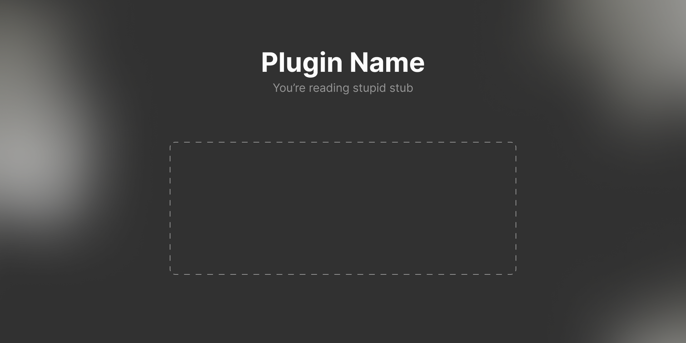

## Plugin Starter

A starter template for building Figma plugins with **TypeScript**, **Astro**, and **Vite**. Contains everything you need to get started with a fully typed, modern plugin development setup.

## **How to use**

### Quick start

1. Install [Node.js](https://nodejs.org/en/download)
2. Clone / download the repo 
3. Run `npm i` in terminal to install dependencies
4. Run `npm run dev` to rebuild plugin on each change

### Running plugin in Figma

You need Figma desktop app to test local plugins.
Go to Actions `⌘K` › Plugins & Widgets › Import from manifest (at the bottom).

Open console (`⌘⌥I` › Console) to see logs and errors.

### Remember to update


### Project structure
```
src/
  ├── code.ts           # Main plugin logic
  └── ui/
    ├── components/     # Reusable Astro components
    └── index.astro     # Main plugin UI
manifest.json           # Plugin name and configuration
package.json            # NPM package info
```

### Development workflow
- **`npm run dev`** - Watches `src/code.ts` and rebuilds `dist/code.js` on changes
- **`npm run build`** - Builds both plugin code and UI for production
- Edit files in `src/` and changes will automatically rebuild

---

## **Template for your plugin readme**

# Plugin name for Figma

Plugin description



### How to use

**Just run it** from the Quick Actions or Plugin menu. 

Alternatively, select layers and the plugin will `<do this>`.

### How it works

`<Explain the approach>`
Plugin will do `<things>` with selected layers.

### Feedback

I accept feature suggestions and ideas to improve the plugin. If you have any ideas or issues, let me know in the comments.

Or contact me via e-mail at [nick@qurle.net](mailto:nick@qurle.net?subject=<Plugin%20for%Figma>) or [Telegram](http://t.me/qurle).

# <3
